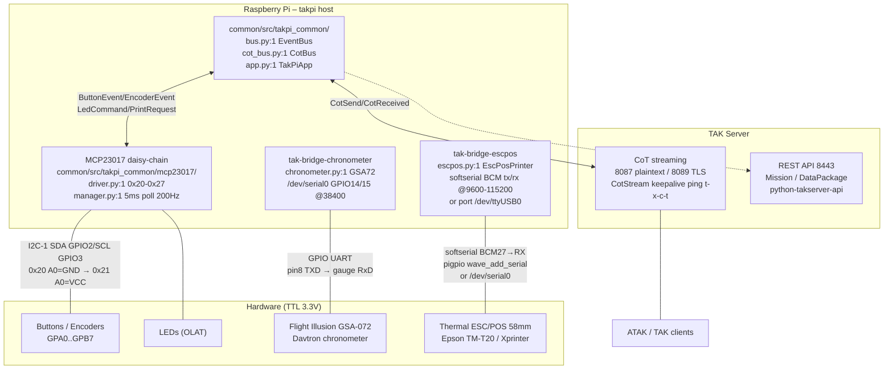
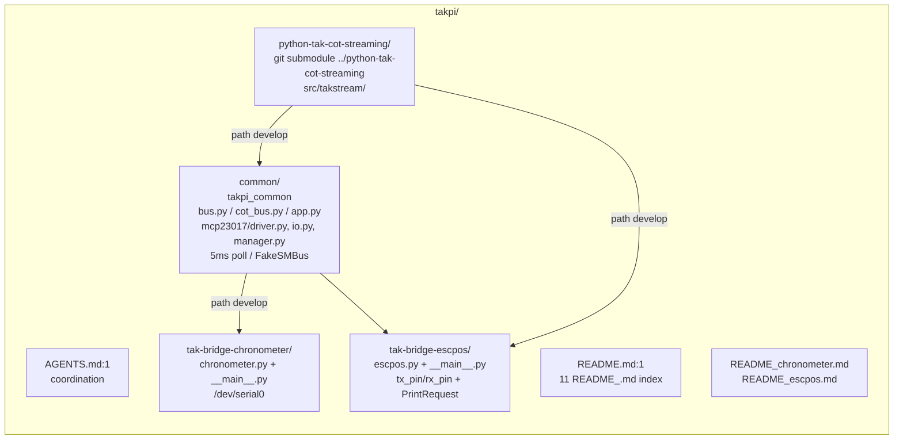
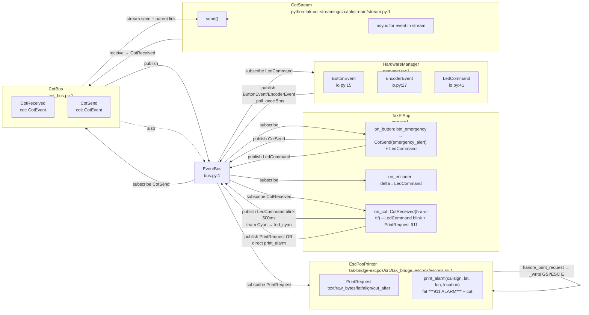
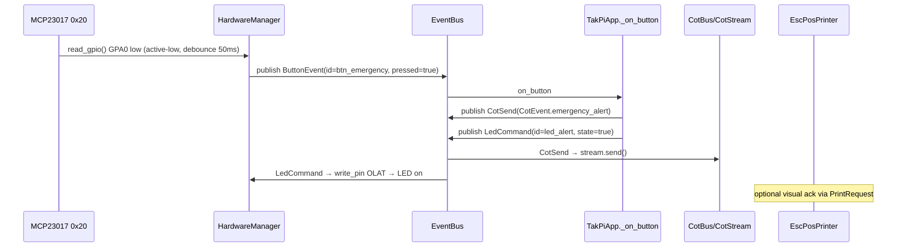
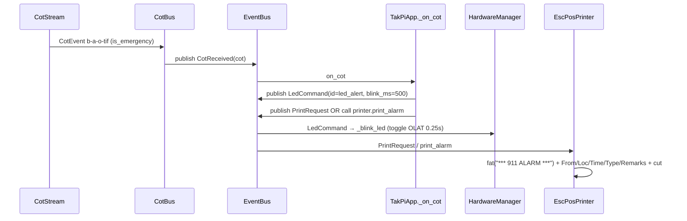
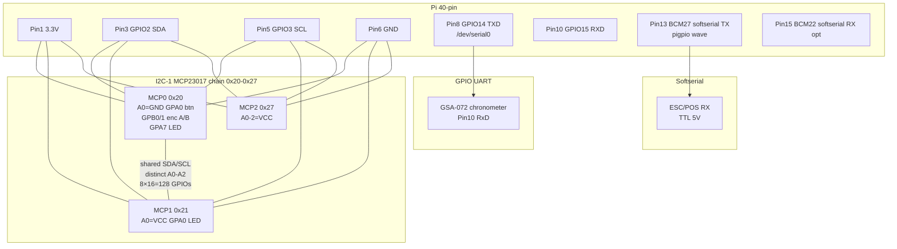
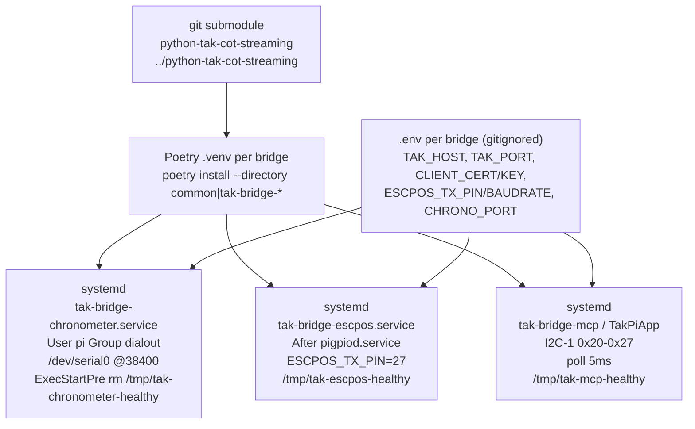

# takpi – Architecture Overview

> **Monorepo:** `takpi/` – Raspberry Pi TAK Hardware Bridge Collection  
> **Python:** 3.12+, Poetry `poetry-core>=2.0`, `black` 88 `py312`, `mypy --strict`, `pylint`, `pytest`+`Fake*` – all via `.venv`  
> **TAK:** `python-tak-cot-streaming` (`takstream.CotStream`/`CotEvent`, **not `pytak`**) via git submodule `takpi/python-tak-cot-streaming` (`../python-tak-cot-streaming`) + `python-takserver-api` (Mission API) – mTLS PEMs  
> **Platform:** Raspberry Pi OS, `systemd` per bridge, `HEALTH_FILE=/tmp/tak-<bridge>-healthy`, `.env` gitignored

This document aggregates the monorepo architecture. For per-submodule deep dives see `README.md:15` (11 `README_<topic>.md` index) and `AGENTS.md:1`.

---

## 1. System Context



**Not pytak:** every new bridge uses `takstream` – `CotEvent.marker`/`sa_report`/`chat_message`/`emergency_alert`, `CotStream.connect(host,port,cert,key,callsign,team,role)` `common/README_cot.md:1`, submodule `takpi/python-tak-cot-streaming/src/takstream/cot.py:1`/`stream.py:1`.

---

## 2. Monorepo Layout



```
takpi/
  AGENTS.md, README.md + README_chronometer.md / README_escpos.md (top-level aggregations, 11 docs)
  python-tak-cot-streaming/  # git submodule ../python-tak-cot-streaming (takstream, not pytak)
  common/
    src/takpi_common/bus.py, cot_bus.py, app.py, health.py, config.py, mcp23017/driver.py, io.py, manager.py
    tests/test_*.py (23, FakeSMBus/AsyncMock)
    examples/panel_demo.py (fake hardware + fake CoT)
  tak-bridge-chronometer/  src/tak_bridge_chronometer/chronometer.py, __main__.py, tests, systemd, README_*.md
  tak-bridge-escpos/       src/tak_bridge_escpos/escpos.py, __main__.py, tests, systemd, README_*.md
  ARCHITECTURE.md          # this file
```

**Rules:** each `tak-bridge-*` is `poetry` independent (`pyproject.toml` `poetry-core>=2.0`), shared → `common/src/takpi_common` via `path = "../common"`, no cross-bridge imports except `takpi_common`.

---

## 3. EventBus – Bidirectional Decoupling

**Central** `common/src/takpi_common/bus.py:1` `EventBus` – typed `publish`/`subscribe`/`wait_for`, wildcard `object`, `async`/`sync` handlers, exception-isolated.



**Hardware → Main → CoT** (MCP button triggers emergency):


**CoT → Main → LED + Paper** (emergency → blink + 911 print):


---

## 4. Hardware – Daisy-Chain vs Point-to-Point



* Chronometer: `tak-bridge-chronometer/src/tak_bridge_chronometer/chronometer.py:1` `GSA72_ID=109`, `encode_packet` `ArduIllusion.cpp:32` 2 ms/byte, service `__main__.py:52` `sync_once` hourly `local`+`UTC`.
* MCP: `common/src/takpi_common/mcp23017/driver.py:1` `FakeSMBus` for CI, `manager.py:1` 5 ms poll, debounce 50 ms, quadrature `ENCODER_TABLE`.
* ESC/POS: `tak-bridge-escpos/src/tak_bridge_escpos/escpos.py:1` `HardwareSerial` (`pyserial`) vs `SoftSerial` (`pigpio.wave_add_serial`, `FakePigpio`), configurable `ESCPOS_TX_PIN`/`ESCPOS_RX_PIN` BCM + `ESCPOS_BAUDRATE` 9600-115200, styles `fat` `GS ! 0x11`/`ESC E`, `print_alarm` `PrintRequest` `escpos.py:42`.

---

## 5. Runtime – systemd + Health + Config



* Health: `common/src/takpi_common/health.py:1` `report_health(file, ok)` – absent = healthy, `HEALTH_MAX_ERRORS=3`, `ExecStartPre rm`, `journalctl -u tak-bridge-* -f`, `cat /tmp/tak-*-healthy`.
* Config: `python-dotenv`, `common/src/takpi_common/config.py:1` `load_env`, `TAK_*`, `ESCPOS_*`, `CHRONO_PORT`, `I2C_BUS`.
* Security: `pip-audit` pre-commit, never commit `certs/*.pem/*.p12`, `.gitignore` + `detect-secrets`.
* Testing: `poetry run --directory common pytest -v` 23 tests `FakeSMBus`/`FakeSerial`/`AsyncMock`; `tak-bridge-chronometer` 7, `tak-bridge-escpos` 9 – no Pi/TAK needed, `poetry run mypy src && pylint src` 10.00.

---

## 6. Docs Index (11 `README_<topic>.md`)

`README.md:15` lists all, `AGENTS.md:1` coordination:

* Top-level `README_chronometer.md`, `README_escpos.md`
* `common/README_mcp23017.md`, `README_bus.md`, `README_cot.md`, `README_app.md`
* `tak-bridge-chronometer/README_chronometer.md` + `README_main.md`
* `tak-bridge-escpos/README_escpos.md` + `README_main.md`
* `python-tak-cot-streaming/README.md` upstream

Ready for wiring – `common/examples/panel_demo.py` runs fake hardware+fake CoT (`FakeSMBus` + `AsyncMock` stream) without Pi/TAK to validate `ButtonEvent → CotSend` and `CotReceived → LedCommand`/`PrintRequest`.

